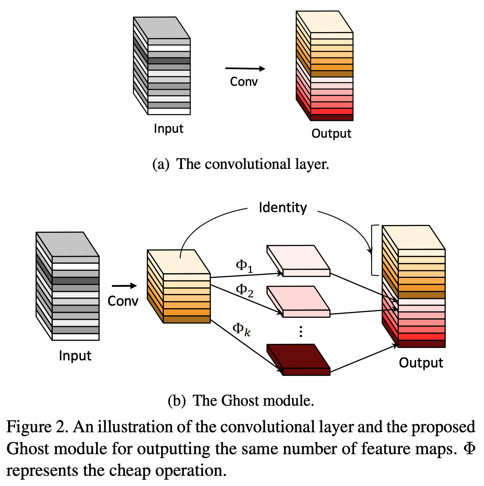

[PyTorch] GhostNet: More Features from Cheap Operations
=====
PyTorch implementation of "GhostNet: More Features from Cheap Operations"

## Concept
<div align="center">
      
  <p>Concept ot the GhostNet [1].</p>
</div>

## Results

### Loss & Accuracy

    

### Performance

|Indicator|Value|
|:---|:---:|
|Accuracy|0.99140|
|Precision|0.99154|
|Recall|0.99129|
|F1-Score|0.99136|

```
Confusion Matrix
[[ 977    0    0    0    0    0    1    1    1    0]
 [   0 1128    2    0    2    0    3    0    0    0]
 [   2    0 1026    2    1    0    0    1    0    0]
 [   0    0    3 1007    0    0    0    0    0    0]
 [   0    0    0    0  981    0    0    0    0    1]
 [   1    0    1   11    0  877    1    1    0    0]
 [   3    2    0    1    3    1  948    0    0    0]
 [   0    3    0    1    1    0    0 1023    0    0]
 [   1    0    2    3    1    0    0    0  966    1]
 [   1    1    1    1   22    0    0    2    0  981]]
Class-0 | Precision: 0.99188, Recall: 0.99694, F1-Score: 0.99440
Class-1 | Precision: 0.99471, Recall: 0.99383, F1-Score: 0.99427
Class-2 | Precision: 0.99130, Recall: 0.99419, F1-Score: 0.99274
Class-3 | Precision: 0.98148, Recall: 0.99703, F1-Score: 0.98919
Class-4 | Precision: 0.97033, Recall: 0.99898, F1-Score: 0.98445
Class-5 | Precision: 0.99886, Recall: 0.98318, F1-Score: 0.99096
Class-6 | Precision: 0.99475, Recall: 0.98956, F1-Score: 0.99215
Class-7 | Precision: 0.99514, Recall: 0.99514, F1-Score: 0.99514
Class-8 | Precision: 0.99897, Recall: 0.99179, F1-Score: 0.99536
Class-9 | Precision: 0.99797, Recall: 0.97225, F1-Score: 0.98494

Total | Accuracy: 0.99140, Precision: 0.99154, Recall: 0.99129, F1-Score: 0.99136
```

## Requirements
* PyTorch 1.11.0

## Reference
[1] Han, Kai, et al. <a href="https://openaccess.thecvf.com/content_CVPR_2020/html/Han_GhostNet_More_Features_From_Cheap_Operations_CVPR_2020_paper.html">"Ghostnet: More features from cheap operations."</a> Proceedings of the IEEE/CVF conference on computer vision and pattern recognition. 2020.
